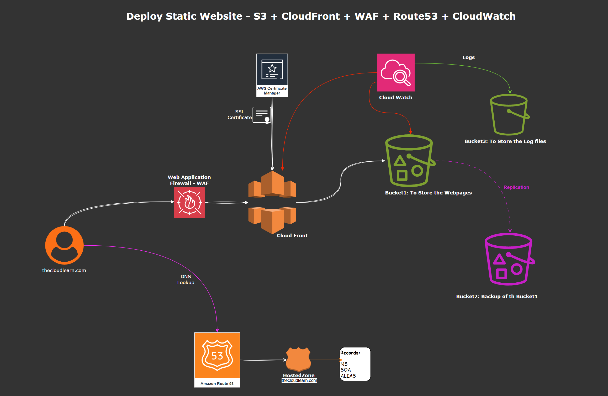

# Production-Ready Static Website Deplyment on AWS ( S3 + CloudFront + Route53 + Security + Monitoring)

## Section 1 - Project Overview
Deploy a Secure, scalable, static website using
* S3 (secure Static File Hosting)
* CloudFront ( CDN + HTTPS + Caching)
* ACM (SSL Certificate)
* Route53 (Domain + DNS)
* WAF (Web Security)
* CloudWatch + CloudTrail (Monitoring & auditing)
* S3 Versioning, lifecycle, logging (best practices)

This is the closest "real company" deployment for static apps like React, Angular, HTML websites, Documentation sites etc..

## Section 2 - Architecture Overview (Real-World)

What you will build:
1. User <--> CloudFront CDN
2. CloudFront retrieves objects from a private S3 bucket
3. HTTPS using ACM
4. WAF protects from attacks
5. Route53 domain points to CloudFront
6. Monitoring, Security, logging enabled everywhere

## Section 3 - Step-by-step Deployment

### Step1: Register a Domain in Route53
### Step2: Create 2 S3 buckets
* Bucket1 : To store Webiste Content (*thecloudlearn-website*)
    * Block all public access
    * Enable Versioning
    * Enable default encryption (SSE-S3)
    * No webiste hosting needed -- Cloudfront will handle routing
* Bucket2: To store logs -- Cloudfront logs (*thecloudlearn-logs*)
    * Enable Versioninig
    * Create a Lifecycle rule to move logs to Glacier after 30 days
* Bucket3: To store the backup of website files from Bucket1 (**OPTIONAL**)

### Step3: Upload Website Files to S3 Bucket1
* Upload *index.html* file as a private object 

### Step4: Create SSL Certificate (ACM)
* Request a Public Certificate

### Step5: Create Origin Access Control (OAC)
* will be created automatically at the time of CloudFron tdistribution creation, we can review and modify at any time.

* This allows Cloudfront to securel access the S3 bucket, *without making the bucket public.*

Goto Cloudfront --> *Origin access* under Security --> Click on *Create control setting* --> Enter meaningfull Name and Description --> Select *Sign requests* as Signing behaviour --> Origin Type *S3* --> Create

### Step6: Create a Cloudfront Distribution
* Origin Configuration
    * Origin Type: S3 bucket
    * Attach the OAC created above
    * Set Origin path (Optional)

* Cache Behaviour
    * Viewer protocol policy: redirect HTTP --> HTTPS
    * Allowed methods: GET, HEAD
    * Cache Policy
        * HTML --> Low TTL (0-60 sec)
        * CSS/JS --> High TTL (1 day - 1week)
* Security
    * HTTPS Required
    * Add AWS WAF Web ACL (Will be created by CloudFront)
    * Enable Origin Shield (Not available in Free trial)
* Logging
    * Enable Cloudfront access logs --> store in thecloudlearn-logs S3 bucket
* Custom Domain/ Alternate Domain
    * Add: thecloudlearn.com and www.thecloudlearn.com      
Select the SSL Certificate which requested through ACM ealrier.

Goto CloudFront --> Distributions --> Create Distribution --> Choose a Plan as "pay as you go" ( **Free is recommended for us**) --> Next --> Enter a Name for the Distribution --> Description --> Enter the domain name *thecloudlearn.com* if it is registered or hosted in route53 --> **Origin Type:** Amazon S3 --> Select the bucket *thecloudlearn.com* under S3 origin --> **Origin Path** Leave blank --> Select *Allow private S3 bucket access to CloudFront* under settings --> Default options for *origin Settings* and *Cache Settings* --> Next --> WAF --> Next --> Review all Configurations --> Click on Create

Click Edit under General Tab of the distribution and add root document as *index.html* 

### Step7: Route53 DNS Configuration

Create 2 Alias record for thecloudlearn.com to point the cludfront distribution, so that the users can access the website with thecloudlearn.com

** Create two Alias records:

|Record|Type|Value|
|:------:|:---:|:--:|
|thecloudlearn.com| A | Alias --> CloudFrot Distribution|
|www.thecloudlearn.com| A | Alias --> CloudFrot Distribution|

--> Go to Route53 --> HostedZones --> Click on *thecloudlearn.com* Hosed Zone --> Create Record --> Record Type *A* --> Toggle *Alias* button --> Select *Alias to CloudFront distribution* under Route Traffic to --> Choose the CloudFront Distribution Name --> **Routing Policy:** Simple routing --> Create Records

**Repeat the same for www.thecloudlearn.com too**

### Step8: Secure the Architecture with AWS WAF

Goto WAF --> Observe that **Protection Packs (WebACLs)** created automatically by CLoudfron --> You can add extra rules (Business PLan required)

### Step9: Enable Monitoring & Auditing
* Create Cloudwatch alarms to trigger email alerts whenever there are high number of 4xx and 5xx errors

#### Step9.1: Create a CLoudWatch DashBoard to monitor 4xx and 5xx errors
* Goto CloudWatch --> Click on Metrics on Left side --> Choose CLoudFront --> Per-Distribution Metrics --> Selct the metrics *requests*, *BytesDownloaded*, *4xxErrorRate*, *5xxErrorRate*, *TotalErrorrate* etc. --> Observe and create a DashBoard too

#### Step9.2: Create alarm for High 4xx Errors
Goal: Alert when user-side errors(broken links, unauthorized etc..) cross a threshold

Goto CloudWatch --> All Alarms --> Create Alarm --> Select Metric --> Choose CLoudFront --> Per-Distribution Metrics --> Selct the metric *4xxErrorRate* --> Select metric --> **Statistic:** Average --> **Period:** 5 Mins --> **Threshold Type:** Static --> Greater than --> 2 --> Next --> **Alarm State Trigger:** In Alarm --> Create New Topic --> New Topic Name --> Enter Email Address --> Create Topic --> Next --> Alarm name --> Next --> Create Alarm

#### Step9.3: Store the CLoudfront logs in AWS S3 bucket "thecloudlearn-logs"

Go to CloudFront --> Distributions --> Click on the Distribution --> select "Logging" tab --> Create access log delivery --> Deliver to "Amazon S3" --> Select "Destination S3 bucket" --> Submit

## Section4: Final Production Architecture Summary

You Now have:
* Highly available global website
* Private S3 bucket securely accessed via Cloudfront OAC
* Custom domain + free SSL
* WAF protection
* Logging + auditable + scalable
* Industry-standard best practices implemented

This is Exaclty how real companies deploy marketing webistes, documnetation portals, static dashboards, React/Angular builds etc.